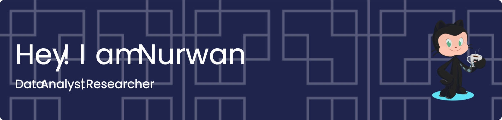

### 💫 About Me:
Hi, I'm Nurwan 👋 I’m a data analyst and researcher with a strong foundation in transforming raw data into actionable insights.  💡 My work bridges the gap between data and strategy—whether it’s uncovering patterns in consumer behavior, tracking business KPIs, or creating compelling data visualizations. I thrive on solving complex problems and communicating results clearly to both technical and non-technical stakeholders.

##### 💻 Skills:

##### 📊 GitHub Stats:
 
 

---

<!-- Proudly created with GPRM ( https://gprm.itsvg.in ) -->
